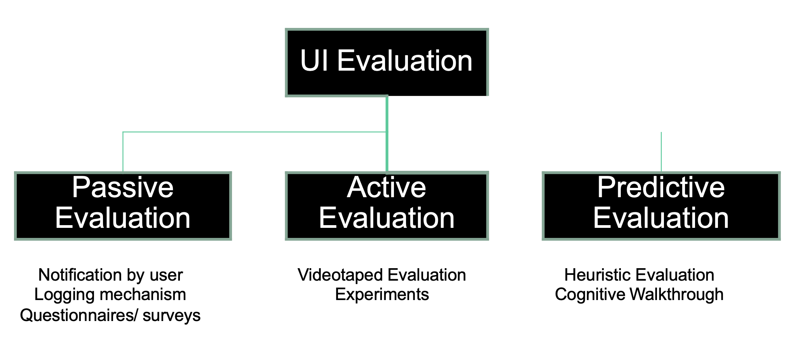
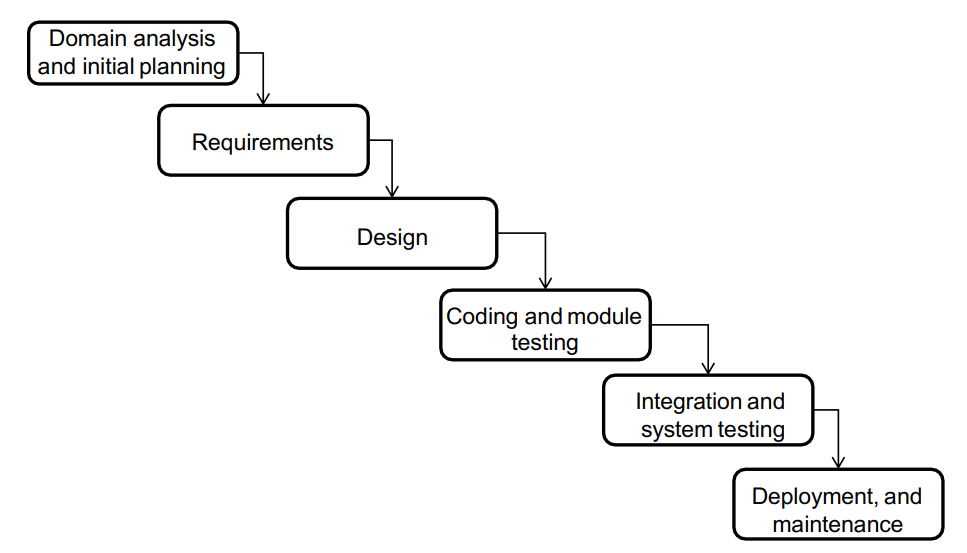

# SEG 3125 学习资料

## TopicA Introduction to Human Computer Interactions 人机交互导论

## 定义

- 研究人与计算及其相互影响的方式
- 人类用户使用并与计算机交互的一组过程、对话和操作
- 与人类使用的交互式计算系统的设计、评估和实现有关的学科

### 为什么要学习用户界面设计?

- 用户界面软件变得越来越复杂
  - 复杂度的增加速度比系统的其他方面更快
  - 图形用户界面提供了复杂度方面的最大飞跃
  - 应用程序往往会随着可用的计算资源增长而增长
- 改进用户界面可以带来直接的经济效益
  - 提高用户生产力 - 直接节省成本
  - 增加销售收入
  - 系统更具吸引力，客户满意度更高
  - 减少培训和支持成本 - 该系统更易于理解和使用
- 减少维修费用
  - 系统做用户想做的事情
  - 许多维护都涉及到修复UI问题
  - 在开发过程中付一点钱，或者在应用程序/产品发布之后付一大笔钱!
- 但是
  - 员工需要接受培训
  - 用户需要参与
  - 需要使用UI设计工具
- 好处是，收益总是大于成本

早期的计算机非常昂贵，功能也少，没有人在意用户交互界面，直到80年代，人们才开始考虑用户友好（user friendly）

### Human Computer Interactions的目标

通过以下方式提高生产力并降低成本：

- 适当的功能Proper functionality：程序按预期运行
- 一致性Consistency：每次遇到 UI 元素时，其功能都相同（有助于建立正确的心理模型）
- 效率Efficiency：UI 帮助用户及时完成任务，同时消除不必要的步骤
- 易用性Usability：系统易于学习
- 可靠性Reliability：系统运行无大问题
- 安全性和数据完整性Security and Data Integrity：程序保护用户数据不受篡改和更改的影响

### Human Computer Interactions的五大要点

1. 可见性Visibility

   UI 应始终帮助用户了解... 

   - 系统的当前状态
   - 可进行的操作

2. 反馈Feedback

   - 当任何事情发生变化时，都应该让其可见（删除文件不能只是告诉用户“完成”或“ready”）

3. 可供性 Affordability

   - 可应用于对象的一组操作和程序 
   - “感知可供性”是典型用户认为可应用于对象的操作 
     - 门是应该推还是拉？
     - 这个图标代表什么？
   - 要改善可见性/反馈，我们需要：
     - 选择具有良好感知可供性的对象
     - 设计 UI 以生成更好的感知可供性

4. 任务 Task

   - 用户想要执行的过程：

     - 给别人打电话

     - 保存文件

   - 目标产生任务，任务产生目标。

5. 目标 Goal
   - 用户想要达到的状态：
     - 成功地和别人通电话
     - 成功地保存了一份文件

### 了解用户

#### 双处理器理论 Dual Processor Theory

每个交互式系统都是在两个处理器上运行的分布式系统

UI设计具体说明并约束了两者：

- 用户行为
- 系统行为

用户可以按以下方式分类：

- 按类别
  - 根据使用模式确定：例如，经理、销售员、发货员、客户
- 按人格类型
  - 害羞或缄默Shy or reticent
  - 说话不清楚Inarticulate
  - 不感兴趣或有抵触情绪Disinterested or defensive
  - 受到威胁Intimidated
  - 参与式设计者！Involved designer!

- 按能力

  - 身体残障 → 可能需要创新的输入/输出设备

  - 色盲 → 不要只使用颜色来传达信息

  - 阅读障碍或其他认知障碍 → 注意左右之分！

  - 文盲 → 可能需要使用图标

  - 电脑盲或领域不熟悉者

### 系统设计也要考虑到人类的认知系统

- 感知和表现

  - 有些显示器可能难以理解

    - 蓝色前景

    - 视错觉

    - 颜色上的对比，但不是亮度

    - 太多的颜色，颜色的含义

- 注意力有限制

  - 人们容易分心
    - 提供提示，引导用户注意力
  - 人们在复杂性中迷失
    - 将信息结构化，使其易于浏览
      - 不要有过多的项目
      - 不要有过少的项目
      - 逻辑分组
  - 人们会同时进行多个任务
    - 明确“状态”，以便用户可以前后跳转
  - 一些心理过程是自动的，或者变得自动化（与受控过程相对）
    - 这些过程非常难以改变

- 记忆有限制

  - 短期记忆可以容纳7±2个“块”

    - 避免让用户记住超过这个数量的内容
    - 逻辑分组，使用户能够将它们组块

    - 有意义的内容更容易记住（熟悉度、形象化和一致性有助于内容的意义化）
      - 使用有效的名称和图标（甚至是动画的）
      - 将图标与文字结合使用
      - 图标可以是类比、示例或抽象的，但不能是任意的
      - 注意文化差异（例如洗手间符号）

  - 用户更容易识别而不是回忆
    - 使用菜单、图标、快速查找的方式

### 用户的生产力和可用性

- 用户生产力 = 功能性（计算机可以做什么） * 可用性（人们可以如何使用计算机）
- 如果两者之一为零，系统就毫无用处
- 影响用户生产力的因素
  - 任务的性质和数量
  - 用户的特征（能力，经验等）
  - 工作环境（干扰等）
  - 培训和文档

### HCI所涉及的学科领域

- 认知心理学 – 研究人类感知和思考的能力和局限性
- 人类工效学 – 硬件和软件的效率和安全性
- 语言学 – 命令的语法和语义 – 语音输入输出

- 人工智能

  - 语音输入输出

  - 智能“猜测”用户想要做什么

  - 用户和任务的知识表示 

- 社会学和社会心理学
  - 确保软件在不同文化中发挥作用
- 工程和工业设计
  - 纪律性的基于测量的方法
  - 美学
  - 故事板等

传统的软件开发流程（waterfall）：

经典的迭代设计过程：

### Star Model 星型模型

- 评估是最重要的过程
  - 在发现问题时，UI将要被反复修订

### 经典用户界面系统架构

分层的目的是：简化软件开发和维护

- 所有的层：

  - 同时并行开发

  - 彼此相互影响

  - 包含在完整的系统规范中

  - 一起进行评估

- 层的演化：
  - 功能层在界面的迭代调整过程中应该需要更少的更改
  - 当业务功能发生变化时，所有层都可能需要进行更改，但是希望交互样式保持相似。

### 用户界面故障 User Interface Malfunctions

- 用户需求、期望与系统提供的不符合；
- 可用性出现问题，导致用户无法完成任务；
- 障碍阻碍用户完成所需任务。

值得注意的是：

- 偶尔出现故障是正常的。
- 系统性或者频繁的故障需要被修复！

## TopicB Evaluation of User Interfaces 用户界面的评估

### 三种评估方式：

被动评估，主动评估，预测性评估。

用户界面设计和评估的主要目标:

**最小化故障**

- 注重评价的主要原因:
  - 如果没有评估，设计师就只能“蒙上眼睛”
  - 设计师不会真正知道他们是否以最有效的方式解决了客户的问题

### 通过各种评估技术回答的问题:

1. 用户的真实任务是什么？ 
   - 在需求分析的过程中进行评估，以预防后续的故障 
   - 不恰当的需求是故障的主要原因之一
2. 用户的真实任务是什么？
   - 通过在需求分析中进行评估，预防后期故障 
   - 不合适的需求是故障的主要来源
3. 用户在UI上可能会遇到哪些问题？
   - 直接找出故障
4. 多个界面中哪一个更好？
   - 选择导致故障较少的版本
5. UI是否符合可用性目标？
   - 确保故障计数足够低
6. UI是否符合标准？
   - 利用集体智慧来减少故障

### 故障分析

但是，为了评估给设计师反馈，我们必须明白为什么会发生故障

故障分析:

-  确定故障发生的原因
- 确定如何消除故障

一种有纪律的方法来分析故障 

- 为重新设计过程提供反馈

1. 使用评估技术之一来查找故障
2. 回答三个不同的问题： 
   - Q1. 故障如何表现出来？ 你注意到了什么，谁注意到了？ 
   - Q2. 它发生在交互的哪个阶段？ 目标形成，动作决策，动作执行，结果解释 
   - Q3. 它发生在用户界面的哪个级别？ 从UI元素级别到任务级别
3. 列出并优先考虑可能的解决方案

#### Q1. 故障如何表现出来？ 你注意到了什么，谁注意到了？

##### a) 系统检测到的故障（最容易检测） 

- 缺少参数 

- 不正确的日期格式

解决方案：

- 更好的提示，一致性，可见的示例，更容忍的替代方案

##### b) 用户在操作过程中检测到的故障（相对较难检测）

- 在菜单层次结构中选择错误的路径

- 没有找到所需的帮助
- 无法执行某个操作
- 无法确定系统处于哪个状态 

解决方案：

- 提高功能性，反馈，清晰度，简洁性

##### c) 系统未检测到的故障（直到以后）

- 由于输入错误导致输出错误
- 执行了不必要的工作 

解决方案：

- 改善反馈，指示输入的后果；简化操作

##### d) 低效性

- 过多的步骤和点击。
- 不必要的长命令序列
- 不必要的重复
- 需要使用参考的复杂操作 

解决方案：

- 简化，加快系统

#### Q2. 它发生在交互的哪个阶段？ 目标形成，动作决策，动作执行，结果解释 

##### a) 当用户决定下一个目标时（形成了一个不合适的意图）

- 用户认为某个字段不重要，决定清空它（但实际上该字段很重要）
- 用户决定使用默认汇率进行兑换（但应该获取当前汇率）

解决方案：

- 更好地引导用户完成任务；提供更好的反馈；提供更好的培训

##### b) 当用户指定动作时（动作与目标不匹配）

- 删除记录而不是清空字段
- 收取汇率的倒数（相反的）

解决方案：

- 提高清晰度、反馈、提示、概念模型

##### c) 当系统执行操作时

- 功能缺陷

解决方案：

- 修复功能

##### d) 当用户解释结果的系统状态时

- 用户认为银行账户已经被扣款，但实际上并没有
- 用户认为系统已经“挂起”，但实际上并没有
- 用户认为必须输入某些数据，但实际上是默认值
- 用户无法理解结果的错误消息

解决方案：

- 更好的反馈，更好的概念模型

#### Q3. 它发生在用户界面的哪个级别？ 从UI元素级别到任务级别

##### a) 任务级别（系统不支持任务和目标）

- 用户想要完成的任务无法在系统中完成
- 系统没有提供相应的功能

解决方案：

- 添加相应的功能

##### b) 概念层级

- 用户认为将文件拖到桌面上意味着它们不再在磁盘上
- 用户认为将磁盘拖到垃圾桶图标中会删除磁盘内容

解决方案：

- 让概念模型更清晰；改进隐喻

##### c) 交互风格级别（系统范围的问题）

- 不知道如何下拉菜单
- 滚动一页而不是一行
- 前往下一个屏幕而不是滚动
- 在错误后重新输入命令而不是编辑

解决方案：

- 使接口操作更直观和一致
- 改善感知的可行性

##### d) 交互元素级别（特定细节不当）

- 由于误解标签而选择错误的按钮
- 指定无效的命令语法
- 指定错误的选项代码

解决方案：

- 更多地关注界面的细节，简化

### 评估方法

形式评估 Formative：

- 在设计和维护我们正在开发的软件时进行
- 回答“为什么？”

综合评估Summative：

- 在评估其他人开发的成品时进行
- 证明系统的有效性！

#### 三种类型的评估方法

**被动passive**

E.g. logs

**主动active**

E.g. Experiments

**预测性predictive**

E.g.Heuristics

三种都很有用，应该并列使用

##### Passive Evaluation 被动评估

- 在原型设计、Alpha测试以及后期进行 

- 不会主动寻找故障

- 只有当它们偶然发生时才会发现
- 不经常出现（但可能很严重）的故障可能无法被发现
- 通常需要对系统进行实际使用
- 用户会因故障而感到沮丧

用户的问题报告：

- 用户应该有一个注册他们的不满/建议的简单方法
- 最好与软件集成

自动软件日志

- 可以收集关于使用情况的大量数据 • 命令频率 • 错误频率和出错前的模式 • 撤销的操作（表示有故障）
- 隐私是一个问题
- 系统必须设计为可测试性 (DFT)
- 例如，Microsoft的服务质量监控 (SQM)

问卷/调查

- 从大量用户中获取统计数据的有用方式 • 需要适当的统计方法来分析结果
- 问题可以是封闭的或开放的
- 封闭问题更容易分析，可以由计算机完成
- 可以向大量人群进行调查
- 纸质、电子邮件和网络用于传播
- 很难将问题恰当地表达
- 在网络上，样本量未知的情况很常见，因此抽样可能是一个问题

##### Active Evaluation 主动评估

- 研究用户执行的某些活动

- 在原型制作期间和之后执行

- 在本课程中，涵盖了两种类型：

  - 观察会议（录像评估）简单观察或合作评估
  - 录像评估
    - 软件工程师研究正在积极使用用户界面的用户，观察他们遇到的问题，而不是仅仅测量数字
    - 会录制会话的视频，可以在用户的环境中进行
    - 用户的活动：
      - 执行预定义的任务，可能有详细的执行说明
      - 最好像在房间里独自一人时对自己说话
        - 产生“思维过程协议”（think-aloud protocol）
        - 当软件工程师和用户相互交流时，称为“协作式”评估
    - 视频很重要：
      - 可以观察到更多细节
      - 可以根据自己建立的心理模型来解释看到的内容
      - 可以捕捉到细节
      - 可以反复分析
    - 使用视频评估的技巧：
      - 多个摄像头拍摄
      - 划分和标记片段来帮助分析
      - 视频评估很费时间，需要提前规划

  - 实验传统或可用性实验

#### 两种类型的UI实验

##### 传统科学实验（研究导向）（大概率用不到）Traditional scientific experiments (research oriented)

- 试图科学证明某种交互方法优于其他方法 
- 现今大多数局限于研究实验室中。

1. 选择一组受试者

- 应该多样化以避免偏见
- 必须代表您的用户群体
- 受试者人数应该足够大，以便获得具有统计学意义的结果（避免运气因素的影响）
- 对于大多数涉及人类受试者的科学实验，这一点都是正确的

2. 选择要测量的变量

- 自变量（Independent variable）: 也称为输入或控制变量
  - 不应该有太多变量
  - 变量不应该受到其他变量的太大影响
  - 寻找可能影响结果的隐藏变量
- 因变量（Dependent variable）: 当自变量改变时，这些变量的值也会发生变化
- 杂项变量（Extraneous Variable）: 实验期间你想要控制的变量。

3. 发展我们的假设

- 预测结果
- 实验的目标是证明假设是有效的

4. 设计实验以测试假设

- 制定零假设
- 反驳零假设！
- 设计这样的实验可能是具有挑战性的

5. 进行实验

6. 分析结果（确保它们在统计上显著） 
   - 例如使用“T- test” 
   - 结论应该有一个特定的置信水平（例如95％的置信水平，假设成立）

7. 根据获得的结果决定采取什么行动以改善可用性

##### 可用性工程（以产品为导向）Usability Engineering (product oriented)

- 测试系统的重要部分
- 缓解传统实验中发现的一些科学限制

用户体验工程的细节：

一个流程，旨在确定用户界面是否符合之前确定的可用性要求

部分工程：设计，评估，重新设计

部分科学：经验方法论，测量变量

尽管如此，与传统的科学实验相比较，不太严格

##### 可用性工程实验所涉及的步骤

1. 选择要评估的关键任务
2. 选择可用性指标
3. 设定计划的可用性水平
4. 使用已建立的可用性标准设计初始用户界面
5. 使用实验分析设计的影响
   - 测量各种可用性指标（类似于传统的实验）

1. 如果实现了可用性目标，则停止。
2. 将用户的评论包括在设计中
3. 返回步骤5

##### 一些可用性指标 

- 完成任务所需的时间
- 每个时间单位内完成的任务的百分比
- 成功率与失败率
- 处理错误的通过率
- 错误命令重复的次数
- 用户取消操作的次数
- 用户没有使用预期的方法完成任务的次数

#### Predictive Evaluation 预测性评估

- 由**专家而非用户**评估系统
- 在UI的要求已经明确之后进行评估，即使在原型制作之前也很有用
- 可以消除用户看到软件之前的许多故障
- 也称为可用性检查

#### 启发式评估

- 由Jakob Nielsen开发 
- 帮助发现用户界面设计中的可用性问题 
- 小组（3-5人）的评估人员检查用户界面 
  - 独立检查遵守可用性原则（“启发式”） 
  - 不同的评估人员会发现不同的问题 
  - 评估人员只在之后进行沟通，然后聚合发现 
- 可以在工作中的用户界面或草图上执行

要使用多个评估人员，使用多种评估方法的好处是：

- 每个评估人员都无法找到所有问题
- 好的评估人可以找到简单的和困难的问题

评估员要多次浏览UI：

- 检查各种对话框元素
- 与可用性原则列表进行比较
- 考虑任何其他想到的原则

Usability principles

- Nielson的：”启发式“
- 补充类别特定启发式列表

使用UI违反Heuristic评估法的情况来重新设计/解决UI问题。

#### 启发式评估的阶段

1）预评估培训

- 为评估者提供所需的领域知识和情景信息 

2）评估

- 个人评估，然后聚合结果

3）严重程度评估

- 确定每个问题的严重程度（优先级） 

4）总结

- 与设计团队讨论结果

- 每个评估员至少进行两次评估

  - 第一次了解系统的流程和范围

  - 第二次专注于特定元素

- 如果系统是即插即用的或评估者是领域专家，则不需要帮助
  - 否则可能会向评估者提供场景支持
- 每个评估员都会列出问题清单
  - 使用启发式或其他信息解释原因
  - 具体列出每个问题

#### 启发式评估

H1-1：简单自然的对话 Simple and natural dialog

H1-2：使用用户的语言 Speak the users’ language

H1-3：尽量减少用户的记忆负担 Minimize users’ memory load

H1-4：一致性 Consistency

H1-5：反馈 Feedback

H1-6：清晰标记的出口 Clearly marked exits

H1-7：快捷方式 Shortcuts

H1-8：准确和建设性的错误信息 Precise and constructive error messages

H1-9：预防错误 Prevent errors

H1-10：帮助和文档 Help and documentation

H2-1: 系统状态的可见性

- 通过合适的反馈及时告知用户正在发生的事情
- 例如：注意响应时间 Visibility of system status
  - 0.1秒到1秒：不需要特殊指示器
  - 1秒到10秒：需要一个有关延迟的小指示器或消息
  - 10秒或更长时间：可能需要更复杂的指示器

H2-2: 系统与真实世界的匹配 Match between system and real world

- 遵循真实世界的约定

H2-3: 用户控制和自由 User control and freedom

- 用户经常会因为错误选择系统功能

- 提供“退出”选项用于纠正错误、撤销和重做

  向导

  - 必须在下一步之前回答问题1
  - 用于不常见任务
  - 例如路由器配置

H2-4: 一致性和标准 Consistency&standards

H2-5: 避免错误 Error prevention

H2-6: 识别性优于记忆性 Recognition rather than recall

- 使对象、操作、选项和指令可见或易于检索

H2-7: 灵活和高效的使用 Flexibility and efficiency of use

- 专家加速器（例如，快捷键）

- 允许用户定制频繁操作（例如，宏）

H2-8: 美学和极简主义设计 Aesthetic and minimalist design

- 对话框中没有不相关的信息

H2-9：帮助用户识别、诊断和恢复错误 Help users recognize, diagnose, and recover from errors

- 以简单的语言提供错误信息
- 精确指出问题所在
- 建设性地建议解决方案

H2-10: 帮助和文档 Help and documentation

- 易于搜索
- 专注于用户的任务
- 列出具体的执行步骤
- 不要太大

#### 问题的严重性评级

用于分配资源来解决问题

通常由“裁判员”（而非评估者本身）执行

频率frequency，影响impact，持久性persistence的集合。

应在所有评估完成后计算

所有裁判员应独立进行评估

#### 严重性等级的评估

1- 不认为这是一个可用性问题 

2- 美观问题 

3- 轻微的可用性问题 

4- 重大的可用性问题；必须解决 

5- 可用性灾难；必须紧急解决

#### Cognitive Walkthroughs（认知漫步）

- 一种预测性评估形式
- 基于心理学理论的详细审查，侧重于：
  - 新用户必须形成执行任务的目标
  - 系统如何引导用户形成这些目标
    - 即系统如何支持用户

- 该方法是高度结构化的
  - 提供表格以指导评估人员
- 比普通的启发式评估更耗时
- 比实验耗时更少
- 关注人类大脑的认知功能

- 为评估者提供界面的表示形式
- 从产品“典型”用户的角度，逐步执行每个任务的动作序列 – 对于序列中的每个步骤，问以下问题
- 用户是否会尝试达到正确的目标？
- 用户是否会注意到正确的操作可用？
- 用户是否将正确的操作与用户试图实现的目标相关联？
- 如果执行了正确的操作，用户是否会看到正在朝着解决任务的目标前进？

- 记录：
  - 成功的案例
  - 失败的案例
  - 设计建议
  - 不是直接从步行测试中得出的问题
  - 关于任务的评论
  - 在设计中可能有用的信息
- 使用标准表格进行此过程
- 对任何已识别的问题进行潜在解决方案的头脑风暴

## TopicC INTERACTION  DESIGN 交互设计

传统的瀑布软件开发流程：

**瀑布流过程的特点：**

- 将设计过程建模为一系列阶段。
- 每个阶段都会产生一个具体的产品（例如，需求或设计文档）。
- 每个阶段结束时进行验证（例如，在编码后进行模块测试或在集成后进行系统测试）。
- 强制设计者先思考再编码。
- 假定程序员是用户。
- 假设要求是固定的（几乎从来没有这种情况）。

**主要问题：**

- 非常死板：无法返回修复先前阶段中的问题/问题。

### 反馈式瀑布图

因此，我们可以引入反馈机制，反馈机制的瀑布图与原先的类似

- 为什么需要反馈？
  - 每个阶段结束时的验证并不总是足够的（有时问题在下一个阶段被发现）。
- 它是否解决了瀑布流过程的问题？
  - 不！如果在早期阶段引入了问题（例如缺少的需求），并且直到较晚的阶段（例如系统测试）才被发现，会怎样？
  - 中间阶段需要昂贵的重做工作。

瀑布模型和UI设计

- “UI设计既是科学又是艺术的结合” ——Jensen Harris
- 因此，UI设计**不是精确的科学**
  - 我们很可能在一开始就会犯错误
- 在瀑布流程中，用户直到后期阶段才参与其中
- UI缺陷可能导致需求和设计的变更
  - 补丁无法解决严重的可用性问题。

可用性的工程是一个过程：需要迭代

### 迭代式设计

这是一种哲学

- 承认我们一开始不会做对
- 评估的结果将指导我们的设计（而不是预先设定的意见）
- 必须确保设计师不会对设计产生情感依恋

何时停止？

1. 当你对获得的结果感到满意时
2. 直到达到可用性目标（如果您已设定特定目标）
3. 直到你没有时间，没有钱为止

学习交互设计的目的是通过一些guidelines减少迭代次数

### Spiral Model螺旋模型

- 尽可能使早期迭代**廉价**
  - 螺旋模型的径向维度对应于迭代步骤的成本（或保真度或准确度）

- 早期实现可能是纸质草图或模型
  - 这被称为低保真度原型
  - 这正是您将为您的项目所做的 
- 更多的原型技术稍后再说...

### Star Model 星型模型

**评估**（Evaluation）是最核心的过程

当发现问题的时候，反复修改用户界面

- 它被认为与整个生命周期的所有阶段都有关，而不仅仅是产品开发的结束阶段。
- 需要大量不同的评估技术来支持不同的设计阶段
- 使用我们在课堂上看到的所有技术（以及其他一些技术）并不罕见。

星形图要避免的是：

- 让每个迭代对应一个发布（这就是瀑布模型）
  - 因为评估反馈要放在下一个版本中考虑
- 用市场上的付费客户来评估UI设计
  - 用户不喜欢的话，就不会再来购买下一个版本了
  - 软件开发行业竞争太大

### User-Centered Design（UCD）用户中心设计

中心问题： 

如何设计用户界面以达到：

- 让用户能够高效地完成任务
- 不浪费用户的时间

的目标。

整个UCD目标是开发一个设计框架，使交互设计师能够构建更易用的系统。

遵循ISO标准-交互式系统的人类中心设计流程

- 用户中心方法基于以下原则：

  - 早期关注用户和任务：直接研究认知、行为和态度特征

  - 持续评估以达到所需的可用性水平

  - 迭代设计：在用户测试中发现问题时，修复它们并进行更多的测试

- 设计应该从以下用户的角度出发
  - 任务 tasks
  - 目标 goals
  - 环境 environment
- 关注以人为本（human-centric）的问题
  - 认知 cognition
  - 感知 perception
  - 身体的属性和条件 physical attributes and conditions
    - 用户 user
    - 环境 environment
- 应当考虑以下问题（接下来细说）：
  - 用户是谁？
  - 我们说“需要”是什么意思？
  - 如何产生替代品？
  - 如何在其他选项中进行选择？

### 考虑哪些因素与用户和利益相关

Eason提出了三个类别：

- 主要用户：频繁亲身体验
- 次要用户：偶尔使用或者通过其他人
- 第三用户：受其引入的影响，或将影响其购买

### 需求的含义（别指望用户）

- 用户很少知道什么是可能的

- 用户通常不能告诉你他们需要什么来帮助他们实现目标

- 相反，看看现有的任务：

  - 它们的上下文

  - 它们需要什么信息？

  - 谁合作完成任务？

  - 为什么以这种方式完成任务？

### 如何产生替代方案

- 人们会坚持自己认为有效的方法
- 然而，考虑到替代方案是重要的，以“打破束缚” break the box
- 如何产生替代方案？
  - “天赋和创造力”：研究和综合
  - 寻找灵感：观察类似的产品或完全不同的产品

### 如何在备选方案中选择

- 与用户或同行进行评估，例如原型

- 技术可行性Technical feasibility：有些方案在技术上是不可能的

- 质量门槛Quality thresholds：可用性目标导致设置早期可用性标准并定期检查

  - 安全性：多安全？

  - 效率：性能测量

  - 错误频率

### 信息收集和调查 Information Collection and  Investigation

- 在收集需求之前/同时，尝试收集有关UI设计的信息
- 这将涉及对用户及其任务的密切研究
  - 不管他们是使用现有版本的软件，另一个软件还是手动完成这些任务... 
- 设计完全新的计算机系统（现在很少发生）可能需要更深入的调查
  - 需要收集更详细的信息
- 调查的起点：确定用户当前正在做什么，他们如何做以及他们在哪里做

### 用户分析

- 以用户为中心的设计方法强调用户的重要性
- 因此，在收集需求之前/期间，您应该进行以下工作：

- 观察用户：真实的用户在应用程序将要使用的地方进行真实的工作。
- 观察和与真实用户交流
  - 许多人将提供信息或对系统有所言论
  - 但您也必须记住观察和与真实用户交谈，即实际使用系统的人
- 在整个设计过程及其活动中，观察、与真正的用户交谈并让他们参与进来

#### 识别用户群体的特征

- 年龄、性别、文化、语言
- 教育程度（识字？计算能力？）
- 身体限制和残疾
- 电脑经验（打字？）
- 领域经验
- 应用经验
- 动机、态度
- 工作环境
- 与组织中其他用户的关系以及典型的沟通模式（用户之间能互相寻求帮助吗？他们是否孤立？）

### 考虑到无障碍人群的需求

- 许多国家都有**法律规定**，禁止在提供商品或服务时歧视残疾人

- **道德层面**上也应该考虑无障碍人群的需求
- 考虑**商业利益**，进行无障碍设计可以赚到残疾人的钱
- 要考虑**视力受损人群**的使用
- 要注意**色盲人群**，色盲人群比较多

### 进行用户分析的方式

技巧

- 问卷和调查（请确保您进行了试运行！）
- 面谈
- 观察

会遇到的障碍

- 开发人员和用户有时会被系统性地隔离开来
  - 技术支持使开发人员远离用户
  - 市场营销使用户远离开发人员
- 一些用户沟通成本较高
  - 医生、高管、工会成员

### 用户档案

可以为用户做一个档案，以下是一个ATM机用户特征的例子：

| 用户特征        | ATM用户特征                                                  |
| --------------- | ------------------------------------------------------------ |
| 年龄            | 大约在12岁到80岁以上                                         |
| 性别            | 男女皆有                                                     |
| 身体限制        | 可能是完全健全的人，也可能在听力、视力、行动、手的使用或使用轮椅方面有一些身体限制。身高各异。 |
| 教育背景        | 可能只有最基本的教育资历和有限的识字和计算技能。             |
| 电脑/ IT 使用   | 可能没有任何计算机或 IT 使用经验。                           |
| 动机 motivation | 很有动力使用自动取款机，特别是如果他们可以快速完成银行业务并避免在银行排长队。 |
| 态度 attitude   | 对使用的态度可能会因自动取款机提供的服务、技术本身的可靠性以及用户对计算机的态度而异。 |

- 这个表描述了整个ATM机客户群体，接下来要将它分成更小的群体。

- 如果我们关注系统的用户，就有更大的成功机会，而不是尝试适应大量用户及其不同的ATM使用模式。
  - 用户有很多种，小孩，青少年，中年人，老年人，使用的方式都不一样。

以下是将用户**按年龄段分类**的情况

| User characteristic | 青少年/年轻成年人                                            | 年轻成年人到中年人                                           | 中年人到老年人                                               |
| ------------------- | ------------------------------------------------------------ | ------------------------------------------------------------ | ------------------------------------------------------------ |
| 年龄                | 12到25岁                                                     | 25到50岁                                                     | 50到80岁及以上                                               |
| 性别                | 男女均有                                                     | 男女均有                                                     | 男女均有                                                     |
| 身体状况限制        | 可能完全健全，也可能存在一些与听力或视力相关的身体状况限制。身高各异。 | 可能完全健全，也可能存在一些与听力或视力相关的身体状况限制。身高各异。 | 可能完全健全，也可能存在一些与听力、视力、行动能力或手部使用相关的身体状况限制。身高各异。 |
| 教育背景            | 可能拥有最少或没有教育背景资格                               | 可能仅有最少的教育背景资格                                   | 可能仅有最少的教育背景资格                                   |
| 电脑/IT使用         | 可能有一些电脑或IT使用经验                                   | 可能没有或很少有电脑或IT使用经验                             | 可能没有或很少有电脑或IT使用经验                             |
| 动机                | 对使用ATM可能非常有动机，特别是与其银行业务习惯有关。        | 可能非常有动机使用ATM，特别是如果他们能快速完成银行业务并避免在银行排队等候。 | 可能非常有动机使用ATM，但他们可能更喜欢看到出纳员。          |
| 态度                | 使用态度可能因ATM所提供的服务和技术的可靠性而异。            | 使用态度可能因ATM所提供的服务和技术的可靠性而异。            | 使用态度可能因ATM所提供的服务和技术的可靠性而异。            |

对特定的用户群体，UI的设计也有要求

| 用户特征                             | ATM UI 要求                                                  |
| :----------------------------------- | :----------------------------------------------------------- |
| 年龄从12到80+                        | ATM 屏幕高度需要适应不同身高的用户。                         |
| 可能完全健全或可能存在某些身体限制   | ATM 屏幕高度需要适应身体健全的用户以及使用拐杖或轮椅的用户。手部关节炎可能会成为问题，因此任何使用的控件都应该适应这一点。 |
| 可能存在一些与听力相关的身体限制     | 所有用户输入都应该具有视觉和听觉反馈。                       |
| 可能存在一些与视力相关的身体限制     | 屏幕文本应该具有合理的大字体，以便视障和非视障人士阅读。     |
| 可能存在一些与手部使用相关的身体限制 | 如果使用触摸屏，则触摸区域应足够大，可以用有限的手部灵活性找到。如果使用触摸屏，则应灵敏到足以响应手指或手部力量减弱的用户。 |
| 缺乏计算机/IT使用经验                | 应用程序应该易于使用（即用户想要执行的任务应该是简单的）。应用程序应该易于学习（即用户应该能够在没有帮助、培训或指导的情况下使用系统）。 |

用虚拟的角色来描述用户，例如：

- 鲍勃是一个来自渥太华的16岁ATM用户。他最近开了他的第一个银行账户。
- Alice是一个75岁的ATM用户。在过去的二十年里，她一直在使用自动取款机。她对旧系统非常熟悉。她受到听力和行动能力的限制

优势

- 便于讨论不同用户类别
- 关注典型用户，而不是极端情况
- 鼓励同理心

缺点

- 可能会误导
- 可能会导致刻板印象

用户角色应严格反映从收集和观察活动中获得的信息

当选择一个人设特征时： 

- 如果不存在与观察到的用户行为直接对应的关系，则不必要或错误
- 这可能导致不正确的设计决策

### ==用户分析常见错误==

描述您的理想用户应该是什么，而不是他们实际上是什么 -”用户应该懂英语，能说流利的斯瓦希里语，右撇子，色盲”

### 任务和目标

任务是：

- 一个过程
- 被一个或多个类型的用户执行
- 以目标为导向
- 也可以有一个超级任务
- 可以分解成子任务

目标是：

- 用户达到他想要的状态
- 通过执行任务完成

避免从“计算机应该做什么”的角度来思考。

一个目标并不总是在执行任务之前完全理解或定义清楚

- 例如，不明确（implicit）的目标：写一封信
  - 一般任务已知
  - 细节将会逐步明确
  - 当用户满意时，目标才会实现
- 例如，明确（explicit）的目标：
  - 将文章添加到库存中
  - 有经验的用户知道任务

如何收集有关任务的信息 

- 观察 

- 问卷和采访

- 对现有系统的当前用户的日志和错误报告

  - 如果你正在设计现有系统的新版本，这个方法非常有效

  - 例如 Microsoft Word 软件质量管理 (SQM)

- 上下文查询
  - 结合了采访和观察的技术
  - 观察用户在真实工作环境中完成真实工作
  - 建立一个师傅和学徒的关系
    - 用户展示如何做并谈论它
    - 访谈的观察和提问
  - 挑战假设，探究惊喜

### 分析任务的过程：

两个基本步骤：

1. 理解并为任务建模
2. 简化个改进每个任务的模型

#### 任务模型：

- a）确定用户群体或用户画像 
- b）创建用户需要执行的所有任务列表
  - 通过观察、问卷、访谈和情境查询识别 
- c）根据使用频率对任务进行优先级排序
  - 稍后，对高优先级任务进行更详细的分析
  - 如果已有系统，则可以测量命令的使用情况（例如MS Word 2007） 

注意，不同类别的用户以不同的频率使用不同的任务

- d) 收集有关任务的其他详细信息
  - 任务是在哪里进行的？
    - 在报刊亭，站着？
  - 环境是什么样的？
    - 嘈杂、肮脏、危险？
  - 任务多长时间执行一次？
    - 也许一周一次
  - 其时间或资源限制是什么？
    - 一两分钟（可能时间很紧！）。
  - 该任务是如何学习的？
    - 通过尝试或询问员工
  - 什么会出错？(例外、错误、紧急情况)
  - 还有谁参与了这项任务？
  - 执行该任务的前提条件是什么？
- e) 为每项任务创建一个图示
  - 可能的技术： 
    - 子任务的层次结构
    - 时间线（情景图）
    - 流程图

任务层次：

#### 简化和改进每个任务模型

a) 尽可能地抽象任务模型

- 确定真正的高级目标
- 删除可以更改的详细信息（低级子任务） 
  - 即，环境或用户的子任务（手动步骤，使用多个工具执行的任务等）
  - 不同系统具有略有不同的次要任务的情况

b) 逐层重新引入细节

- 思考几组可替代的子任务，确定最佳方案
- 使用以下准则：
  - 规范化所有子任务
    - 相似的子任务以相似的方式执行
    - 重新排列子任务的顺序，以简化它们的执行
- 减少用户执行子任务的需要（去除开销）
  - 通过使用默认值，最小化安装和配置
  - 减少用户记忆的需要
  - 确保计算机尽可能地计算所有内容

#### 任务分析中的常见错误

- 从系统的角度思考，而非用户的角度
  - “通知用户有关预约的信息” 而不是 “收到关于预约的通知”
- 用户目标和实现可行性之间的权衡可能是不可避免的
  - 但我们还没有考虑这个问题！
- 过早地固定 UI 设计愿景
  - “系统将显示一个弹出窗口，通知用户有关预约的信息…” 
- 在软件中复制一个糟糕的现有流程
- 未能捕捉现有流程的良好方面

#### 更好的用户和任务分析提示：

- 需要询问的问题

  - 为什么要做这个？（目标）

  - 怎么做？（子任务）

- 寻找现有情况中的弱点
  - 浪费时间，用户沮丧，由于当前限制而出现的明显变通方法
  - 向用户询问当前系统中令他们不满的问题有多么有益！

### Domain Analysis 领域分析

- **目标**：独立于我们打算开发的特定系统，了解问题领域
- 我们不试图划分系统和环境之间的界线
- 能够让软件工程师在需求收集期间更有效地与利益相关者进行沟通

### Entity Relationship Model 实体关系模型

### 设计可用的系统

- 分析
  - 理解用户和他们的任务
- 设计
  - 在设计活动中应用这种理解
- 评估
  - 验证设计决策，看看人们是否真的可以使用这个系统。

Topic C not finished

## TopicD

### Prototype 原型：

A prototype is a small-scale model. **Example**: A paper sketch, A storyboard, A piece of software with limited functionality written in the same target language or another language.

Prototypes are preliminary products, models, or samples used for testing, evaluation, and refinement of design concepts.

### Prototype 好处:

- Evaluation and feedback 可以帮助design.
- stakeholder可以看见，交互，使用prototype，并且吸引投资方兴趣.
- 设计团队可以根据prototype改进设计，更加高效的交流问题和改进方法.
- 可以收集反馈，帮助新一代的原型设计
- Prototypes answer questions, and support designers in choosing between alternatives.

### Filtering dimensions of prototype 原型的过滤维度

过滤维度是从原型中选择出一些最为关键和重要的维度，用于筛选原型，决定哪些原型值得继续投入时间和资源进行进一步的开发和改进，哪些原型需要被淘汰或放置在后备。过滤维度的选择通常取决于项目的具体需求和目标，以及设计团队的优先事项

- Appearance外观 : 大小，颜色， 声音，物品外观....
- Data数据：数据大小，数据格式，数据规整度(organization) ....
- Functionality功能：系统功能...
- Interactivity交互性：输入表现，输出表现...
- Spatial structure空间结构: Arrangement of interface or information elements; relationship among interface elements.界面的布局，元素和元素之间的关系.

设计者可以自己决定维度，Functionality, performance, appearance, user experience, cost.... 都可以作为可选项.

### Manifestation dimensions of prototyping 原型的表现维度

在原型制作过程中，考虑和评估表现维度可以帮助设计团队对不同方面的原型性能进行全面的评估，并作出相应的决策，以改进和优化原型设计。

- Material: Physical media (e.g. paper, cards); software prototyping tools (e.g. Flash); programing language (e.g. Java)选择合适的材料对于实现原型的功能和性能至关重要
- Resolution: level of detail or sophistication of what is manifested – Accuracy of performance (e.g. response time); appearance details; realistic vs. faked date. 表现的详细程度或复杂度, 高分辨率的原型可能更加精确和真实，但也可能需要更多的资源和时间来制作.
- Scope – Range of what is going to be manifested – Breadth fidelity and depth fidelity. 考虑范围可以帮助设计团队决定在原型中展现哪些方面，并确保表现的准确度.

#### Fidelty 保真度: degree to which prototype looks and feels like the final product.

Low fidelity: omits details忽略细节.  优点：便宜，便于制作，易于更改.

High fidelity: more like finished product. 优点：功能更多，更像完成的产品，提供更详细的体验. 缺点：贵， 耗费时间，难以更改.

Breadth: percentage of features covered. 

- Breath 指的是原型能够准确地展现产品的各个方面，Depth指的是原型在某个特定方面的深入程度。

Depth: degree of functionality (limited choices, static responses, error handling)

- Depth指的是原型在某个特定方面的深入程度

### Paper Prototype 纸质原型

Paper prototypes are an excellent choice for early design iterations.

Main difference between a paper sketch and paper prototype is interactivity.

Usually hand sketched on multiple pieces (showing different menus, dialog boxes or window element)

Paper Prototype is a low fidelity in look.

high fidelity in breadth of supported features at very little cost.通过纸张模拟窗口和功能

high fidelity in depth at little cost as well (human is simulating the backend).纸质模型可以通过多张纸模拟计算机的功能和反馈.

#### 优点：

- Faster to build 对比programming
- Easier to change
  - No code investment – everything will be thrown away (except the resulting design
  - Easy to make changes between user tests or even during a user test
- Focuses the attention on the big picture.
- Nonprogrammers can help.不需要技术也可以帮忙设计原型

#### 缺点：

- Look 无法感受到真正的外观(color, realtion between element, windows layout)
- Feel - Efficiency issues (you will not get a sense of how the interaction feels.无法感受到交互体验
- Response time

### Change Blindness:

When a change in a visual stimulus is introduced and the observer does not notice it.

### Look and Feel High-fidelity prototyping高保真度模型:

#### 'Wizard-of-Oz’ prototyping 

The user thinks they are interacting with a computer, but a developer is responding to output rather than the system. 程序员代替系统来反馈给用户

Usually done early in design to understand users’ expectations.

这种方法可以用于测试用户对于系统的理解、反应和期望，以便在系统开发的早期阶段获取用户反馈，并对设计进行迭代和改进。

The person playing the role of the computer must be very familiar with the functionality of the proposed system

It is more appropriate with natural language interfaces rather than graphic interface.

自然语言界面（Natural Language Interface，简称NLI）是一种与计算机或其他数字系统进行交互的方式，使用自然语言（如人类语言）作为输入和输出的形式。通过自然语言界面，用户可以使用类似于与人类进行对话的方式与系统进行交互，而无需使用特定的命令或学习复杂的用户界面。

### Interactive Computer Prototype 交互电脑模型：

Software simulation

A typical computer prototype is a horizontal prototype

Its high fidelity in look and feel but low fidelity in dept. 高外观完成度，但是功能实现不多.

优点：

- Everything you learn from a paper prototype

- Screen layout
- Colors, fonts, icons, other element
- Interactive feedback 可以交互
- Efficiency issues 快速找出问题

### Compromise In prototypes原型内容的妥协

**Horizontal**: provides a large set of functions but with very little detail

**Vertical**: provides a lots of details for a small number of function

## TopicF

### Emotions and the user experience 情感和用户体验

Emotional interaction is concerned with how we feel and react when interacting with technology

what makes us happy, sad, annoyed, anxious, frustrated....

将感情转换成用户反馈和用户体验

Challenges:

- 用户是不同的
- Existing emotional state of users modulates their perception 用户的接受程度会受到用户情绪的影响

### Expressive interface：

Provide reassuring feedback that can be both informative and fun, can also be intrusive, causing people to get annoyed and even angry

Color, icons, sounds, graphical elements and animations are used to make the ‘look and feel’ of an interface appealing – conveys an emotional state.各种页面元素和动画可以改变情感状态.

Can affect the usability of an interface.

### Friendly interfaces友好界面：

Make users feel more at ease and comfortable -- Microsoft BOB(软件)

### Frustrating interface：

Like Clippy 

#### Many causes:

- When an application doesn’t work properly or crashes
- When a system doesn’t do what the user wants it to do 
- When a user’s expectations are not met
- When a system does not provide sufficient information to enable the user to know what to do
- When error messages pop up that are vague, obtuse or condemning
- When the appearance of an interface is garish, noisy, gimmicky or patronizing
- When a system requires users to carry out too many steps to perform a task, only to discover a mistake was made earlier and they need to start

### Persuasive User Interfaces and behavioural change

Interactive computing systems deliberately designed to change people’s attitudes and behavior

交互式计算机系统是为改变人们的态度和行为而特意设计的

A diversity of techniques now used to change what they do or think 

- Pop-up ads, warning messages, reminders, prompts, personalized messages, recommendations, Amazon 1- click 广告，警告信息，弹窗 改变人们行为

- Commonly referred to as nudging暗中提醒 影响人们行为

### Affective Computing

Affective computing is the study and development of systems and devices that can recognize, interpret, process, and simulate human affects.

Giving computers the ability to understand human emotions (emotional intelligence)

Computers also emulate the feeling of emotions, or react to a user’s emotional state

### Anthropomorphism 拟人论 

attributing human-like qualities to inanimate objects (e.g. cars, computer)

#### example:

Well known phenomenon in advertising – Dancing butter, drinks, breakfast cereal

Much exploited in human-computer interaction – Make user experience more enjoyable, more motivating, make people feel at ease, reduce anxiety

Students were more willing to continue with exercises with this kind of feedback--- Great work!

Deceptive(欺骗), make people feel anxious, inferior or stupid

**Virtual Charater**---Make people feel involved with them

## TopicG

### Locale本地

Set of features that can be varied depending on the language and culture of the user or the data

### Internationalization (I18N)国际化

The process of designing software so that it can be easily adapted to different locales

### Localization (L10N)本地化

The process of adapting software to a local

### Internationalization Concepts and Terminology

An application must first be **internationalized** before it can be **localized**

#### **An internationalized program has the following characteristics:**

1. With localized data, the same executable can run in all supported locale 拥有本地化的数据这意味着程序会根据不同的语言环境加载相应的本地化数据，例如文字、日期、时间、货币等，以适应不同语言和文化习惯的需求
2. Textual elements are not hard coded 国际化的程序避免使用硬编码的文本，即不直接在代码中嵌入文字，而是将文字作为外部资源进行管理。这样可以使得程序的文本元素可以被独立地翻译和本地化，而不需要修改程序的源代码。
3. New languages support does not require recompilation 新语言不用重新编译（方便切换） 国际化的程序设计成可以在运行时根据需要加载不同的语言资源，而不需要重新编译程序。这意味着可以在不改变程序的源代码的情况下添加新的语言支持，从而提高了程序的灵活性和可维护性。
4. It can be localized quickly 国际化的程序应该设计成可以快速进行本地化，即在添加新的语言支持时，可以方便地进行翻译、调整界面布局和适配不同语言环境的其他要求。这样可以加快程序的本地化进程，使得程序尽早面向不同的语言市场。

In the localization phase, the most time-consuming portion is the translation of text 翻译是最耗时间的

## TopicH

### Type of disability

Visual impairment (near-sightedness, blindness,)

Movement impairment(eg鼠标移动困难)

Cognitive and language impairments(difficulty remembering, dyslexia)

Hearing (hear certain frequencies, deafness)

Seizure disorders（癫痫）

 

### UI guidelines that help with accessibility

1.Provide undo

2.Allow increasing font and image size, and font family.

3.Enable the return of settings to defaults

4.Reduce memory load (Allow taking notes, Recognition, not recall)

5.Provide easy keyboard access to everything(for movement disability), Ensure there is always an alternative to **drag and drop**

6. Post stroke patients study
7. Don’t make mouse targets too small(Allow to make them larger)
8. Provide descriptive text for all visual components

9.Test all colored elements for accessibility to the colorblind

(Increase color contrast beyond the bare minimum needed for sighted people)

10. Allow users to configure the volume and frequencies of sounds

11.Use animation and movement with care (flashing and repeating--seizures)

12.don't use blinking to attract attention (allow all movement to be turned off)

13.Don’t rely on timing (dont use Automated slide shows, Timeouts after no interaction detected or Automated scrolling)

14.Don’t rely on mousing over certain areas to get popup

information

15.Test your software for use with assistive devices

 

### Common Technologies Used to Facilitate Accessibility Online

– Alternative web browsers, Braille for the web, Eye-tracking applications, Head wands, Mouth sticks, Screen magnifiers, Screen readers

 

### Accessibility Testing Tools

1.WAVE(for overall level of accessibility)

2.Color Oracle(for page how a user with color blindness)

3.Image Analyzer(examines images and tests accessibility standards)

 4.testing websites for accessibility with **real users**. Using the data to improve your website design for **everyone**

 

design for better color accessibility

1.colors and symbols

2.patterns and textures to contrast

3.limit the color palette

4.Avoid bad color combos